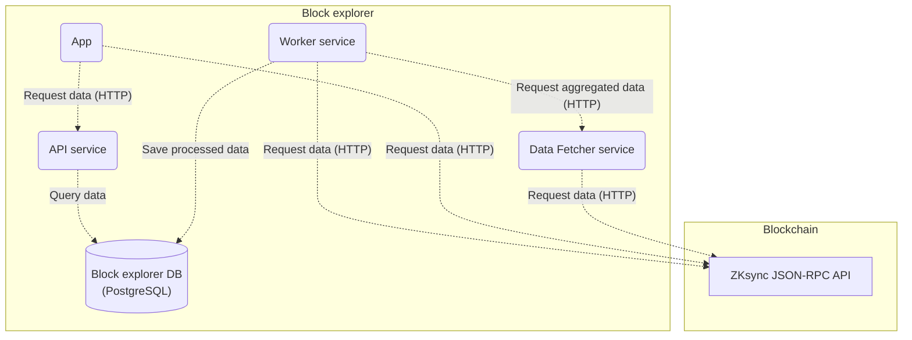

<h1 align="center">ZKsync Block Explorer</h1>

<p align="center">Online blockchain browser for viewing and analyzing <a href="https://zksync.io">ZKsync</a> blockchain.</p>

## 📌 Overview
This repository is a monorepo consisting of 4 packages:
- [Worker](./packages/worker) - an indexer service for [ZKsync](https://zksync.io) blockchain data. The purpose of the service is to read blockchain data in real time, transform it and fill in it's database with the data in a way that makes it easy to be queried by the [API](./packages/api) service.
- [Data Fetcher](./packages/data-fetcher) - a service that exposes and implements an HTTP endpoint to retrieve aggregated data for a certain block / range of blocks from the blockchain. This endpoint is called by the [Worker](./packages/worker) service.
- [API](./packages/api) - a service providing Web API for retrieving structured [ZKsync](https://zksync.io) blockchain data collected by [Worker](./packages/worker). It connects to the Worker's database to be able to query the collected data.
- [App](./packages/app) - a front-end app providing an easy-to-use interface for users to view and inspect transactions, blocks, contracts and more. It makes requests to the [API](./packages/api) to get the data and presents it in a way that's easy to read and understand.

## 🏛 Architecture
The following diagram illustrates how are the block explorer components connected:



[Worker](./packages/worker) service retrieves aggregated data from the [Data Fetcher](./packages/data-fetcher) via HTTP and also directly from the blockchain using [ZKsync JSON-RPC API](https://docs.zksync.io/build/api-reference/ethereum-rpc), processes it and saves into the database. [API](./packages/api) service is connected to the same database where it gets the data from to handle API requests. It performs only read requests to the database. The front-end [App](./packages/app) makes HTTP calls to the Block Explorer [API](./packages/api) to get blockchain data and to the [ZKsync JSON-RPC API](https://docs.zksync.io/build/api-reference/ethereum-rpc) for reading contracts, performing transactions etc.

## 🚀 Features

- ✅ View transactions, blocks, transfers and logs.
- ✅ Inspect accounts, contracts, tokens and balances.
- ✅ Verify smart contracts.
- ✅ Interact with smart contracts.
- ✅ Standalone HTTP API.
- ✅ Local node support.

## 📋 Prerequisites

- Ensure you have `node >= 18.0.0` and `npm >= 9.0.0` installed.

## 🛠 Installation

```bash
npm install
```

## ⚙️ Setting up env variables

### Manually set up env variables
Make sure you have set up all the necessary env variables. Follow setting up env variables instructions for [Worker](./packages/worker#setting-up-env-variables), [Data Fetcher](./packages/data-fetcher#setting-up-env-variables) and [API](./packages/api#setting-up-env-variables). For the [App](./packages/app) package you might want to edit environment config, see [Environment configs](./packages/app#environment-configs).

### Configure custom base token
For networks with a custom base token, make sure to configure the base token for both Worker and API services by following the corresponding instructions [here](./packages/worker/README.md#custom-base-token-configuration) and [here](./packages/api/README.md#custom-base-token-configuration).

## 👨‍💻 Running locally

Before running the solution, make sure you have a database server up and running, you have created a database and set up all the required environment variables.
To create a database run the following command:
```bash
npm run db:create
```

To run all the packages (`Worker`, `Data Fetcher`, `API` and front-end `App`) in `development` mode run the following command from the root directory.
```bash
npm run dev
```

For `production` mode run:
```bash
npm run build
npm run start
```

Each component can also be started individually. Follow individual packages `README` for details.

## 🐳 Running in Docker
There is a docker compose configuration that allows you to run Block Explorer and all its dependencies in docker. Just run the following command to spin up the whole environment:
```
docker compose up
```
It will run local Ethereum node, ZkSync, Postgres DB and all Block Explorer services.

## 🔍 Verify Block Explorer is up and running

To verify front-end `App` is running open http://localhost:3010 in your browser. `API` should be available at http://localhost:3020, `Worker` at http://localhost:3001 and `Data Fetcher` at http://localhost:3040.

## 🎨 Customizing branding and color scheme

The front end supports customization of branding, links, and the color scheme via environment variables or `config.js`. See the [Branding, links, and color scheme](./packages/app/.env.example) section in `.env.example`.

The color scheme configuration can be set either via the `VITE_THEME_CONFIG` environment variable (as a JSON string) or directly in the `config.js` file.

There are 3 ways to define colors:
1) Use standard Tailwind colors (e.g., blue, yellow, green). Shades are defined by Tailwind.
2) Use a single hex color, and all shades will be calculated automatically.
3) Define all shades manually for full control.
Example config:
```
{
  "colors": {
    "primary": {
      "50": "#F3F5FF",
      "100": "#D9D9F9",
      "200": "#CBCBFF",
      "300": "#8C8DFC",
      "400": "#5D65B9",
      "500": "#53579f",
      "600": "#4E529A",
      "700": "#32325D",
      "800": "#27274E",
      "900": "#11142B"
    },
    "secondary": "#FEFCE8",
    "neutral": "gray",
    "success": "green",
    "error": "red",
    "warning": "yellow"
  }
}
```

Some branding configuration (e.g., icon and logo) is network-specific and can be set in the [environment config](./packages/app#environment-configs). See [the interface](./packages/app/src/configs/index.ts) for reference.

## 🕵️‍♂️ Testing
Run unit tests for all packages:
```bash
npm run test
```
Run e2e tests for all packages:
```bash
npm run test:e2e
```
Run tests for a specific package:
```bash
npm run test -w {package}
```
For more details on testing please check individual packages `README`.

## 💻 Conventional Commits
We follow the Conventional Commits [specification](https://www.conventionalcommits.org/en/v1.0.0/#specification).

## 📘 License
ZKsync Block Explorer is distributed under the terms of either

- Apache License, Version 2.0, ([LICENSE-APACHE](LICENSE-APACHE) or <http://www.apache.org/licenses/LICENSE-2.0>)
- MIT license ([LICENSE-MIT](LICENSE-MIT) or <http://opensource.org/licenses/MIT>)

at your option.

## 🔗 Production links
- Testnet Sepolia API: https://block-explorer-api.sepolia.zksync.dev
- Mainnet API: https://block-explorer-api.mainnet.zksync.io
- Testnet Sepolia App: https://sepolia.explorer.zksync.io
- Mainnet App: https://explorer.zksync.io
