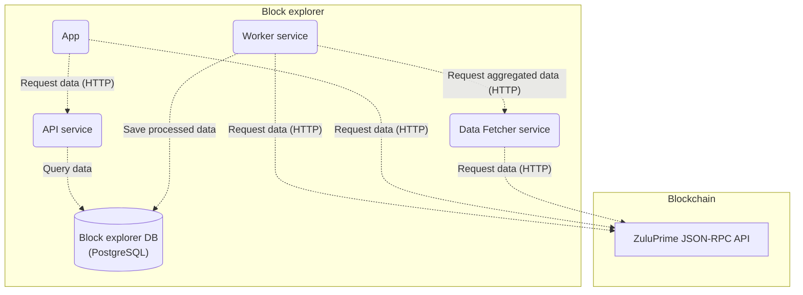

<h1 align="center">ZuluPrime Block Explorer</h1>

<p align="center">Online blockchain browser for viewing and analyzing <a href="https://zulunetwork.io">ZuluPrime</a> blockchain.</p>

## 📌 Overview
This repository is a monorepo consisting of 4 packages:
- [Worker](./packages/worker) - an indexer service for [ZuluPrime](https://zulunetwork.io) blockchain data. The purpose of the service is to read blockchain data in real time, transform it and fill in it's database with the data in a way that makes it easy to be queried by the [API](./packages/api) service.
- [Data Fetcher](./packages/data-fetcher) - a service that exposes and implements an HTTP endpoint to retrieve aggregated data for a certain block / range of blocks from the blockchain. This endpoint is called by the [Worker](./packages/worker) service.
- [API](./packages/api) - a service providing Web API for retrieving structured [ZuluPrime](https://zulunetwork.io) blockchain data collected by [Worker](./packages/worker). It connects to the Worker's database to be able to query the collected data.
- [App](./packages/app) - a front-end app providing an easy-to-use interface for users to view and inspect transactions, blocks, contracts and more. It makes requests to the [API](./packages/api) to get the data and presents it in a way that's easy to read and understand.

## 🏛 Architecture
The following diagram illustrates how are the block explorer components connected:



[Worker](./packages/worker) service retrieves aggregated data from the [Data Fetcher](./packages/data-fetcher) via HTTP and also directly from the blockchain using [ZuluPrime JSON-RPC API](https://era.zulunetwork.io/docs/api/api.html), processes it and saves into the database. [API](./packages/api) service is connected to the same database where it gets the data from to handle API requests. It performs only read requests to the database. The front-end [App](./packages/app) makes HTTP calls to the Block Explorer [API](./packages/api) to get blockchain data and to the [ZuluPrime JSON-RPC API](https://era.zksync.io/docs/api/api.html) for reading contracts, performing transactions etc.

## 🚀 Features

- ✅ View transactions, blocks, transfers and logs.
- ✅ Inspect accounts, contracts, tokens and balances.
- ✅ Verify smart contracts.
- ✅ Interact with smart contracts.
- ✅ Standalone HTTP API.
- ✅ Local node support.


## 🛠 How to RUn
### 📋 Prerequisites

- Ensure you have `node >= 18.0.0` and `npm >= 9.0.0` installed.

#### 🛠 Installation

```bash
npm install
```

### 👨‍💻 Running locally

Before running the solution, make sure you have a database server up and running, you have created a database and set up all the required environment variables.
To create a database run the following command:
```bash
npm run db:create
```

To run all the packages (`Worker`, `Data Fetcher`, `API` and front-end `App`) in `development` mode run the following command from the root directory.
```bash
npm run dev
```

For `production` mode run:
```bash
npm run build
npm run start
```

Each component can also be started individually. Follow individual packages `README` for details.

### 🐳 Running in Docker

```shell
make start_local
```

### 🕵️‍♂️ Testing
Run unit tests for all packages:
```bash
npm run test
```
Run e2e tests for all packages:
```bash
npm run test:e2e
```
Run tests for a specific package:
```bash
npm run test -w {package}
```
For more details on testing please check individual packages `README`.


## Acknowledge
ZuluPrime Block Explorer leverages the power of [`zksync-block-explorer`](https://github.com/matter-labs/block-explorer) from [Matter Labs](https://github.com/matter-labs). 