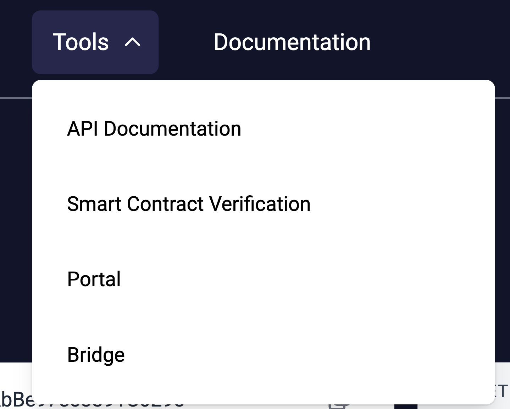

# id253 Header - Common - Internal links-Tools

## Description

## Precondition

## Scenario
- Tools menu contains redirections to:
    - API Documentation
    - https://block-explorer-api.mainnet.zksync.io/docs
- Smart Contract Verification
    - https://staging-scan-v2.zksync.dev/contracts/verify
- zkEVM Debugger (not visible in the menu)
    - https://staging-scan-v2.zksync.dev/tools/debugger
- Bridge
    - https://portal.zksync.io/bridge/
