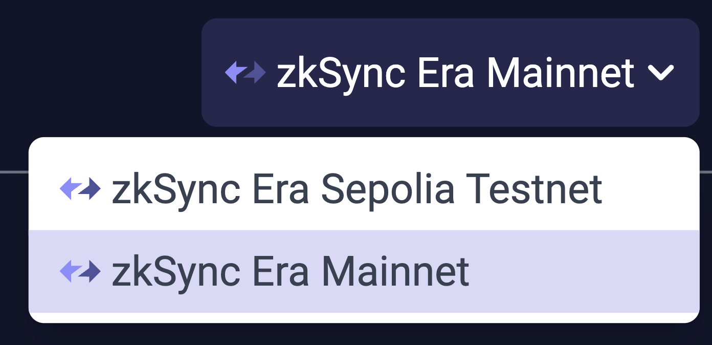

# id705 Header - Common - Artifacts - Network Drop Down

## Description
  - https://explorer.zksync.io/

## Precondition

## Scenario
- Network dropdown contains
    - "zkSync Era Sepolia Testnet" item
- "zkSync Era Mainnet" item
- zkSync logo available for each network
