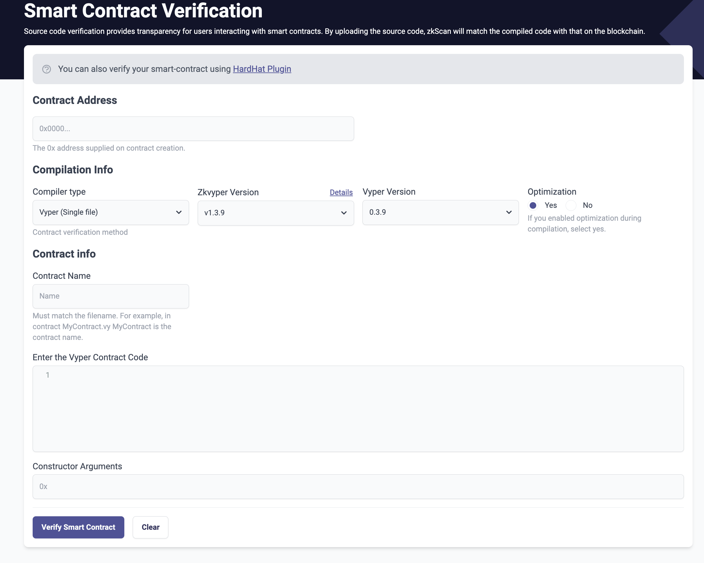

# id1619 SmartContractVerification page - Common - Artifacts - Smart contract verification (UI for Single-Contract Vyper)

## Description
  - https://goerli.explorer.zksync.io/contracts/verify
  - Select "Vyper (Single file)" in "Compiler type" dropdown

## Precondition

## Scenario
- SCV interface:
  
- Notification
    - You can also verify your smart-contract using HardHat Plugin
- Link - "HardHat Plugin"
- "Contract Address" headline
    - Contract address field
    - Placeholder - "0x0000..."
- Text - "The 0x address supplied on contract creation."
- "Compilation Info" headline
    - "Compiler type" dropdown
    - Text - "Contract verification method"
- "Zkvyper version" dropdown
    - "Details" link
- "Vyper version" dropdown
- Optimization
    - "Yes" radiobutton (enabled by default)
- "No" radiobutton
- Text - "If you enabled optimization during compilation, select yes."
- "Contract info" headline
    - "Contract Name" field
    - Placeholder: "Name"
- Text under the field
    - Must match the filename. For example, in contract MyContract.vy MyContract is the contract name.
- Enter the Vyper Contract Code
- Field for Vyper code
- Constructor Arguments
- "Verify Smart Contract" button
- Clear button
