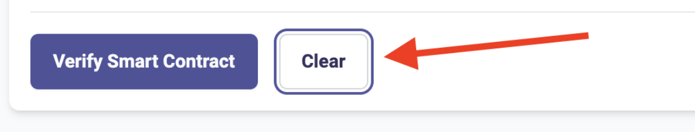
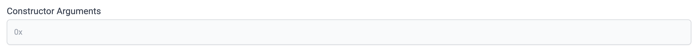

# id1620 SmartContractVerification page - Common - Actions - Clearing the page (Single-file Vyper)

## Description
  - https://goerli.staging-scan-v2.zksync.dev/contracts/verify

## Precondition

## Scenario
- Select "Vyper (Single file)" in "Compiler type" dropdown
- Fill all the fields on Smart Contract Verification page:
    - Contract address field
- Contract Name
- Optimization
- Zkvyper compiler version
- Vyper version
- Enter the Vyper Contract Code
- Constructor Arguments
- Click on Clear button

- Verify text fields are cleared

- Verify "Zkvyper version" and "Vyper Version" dropdowns  set to default values (latest versions)
- Verify "Optimization" radio buttons set to default values (Yes)
