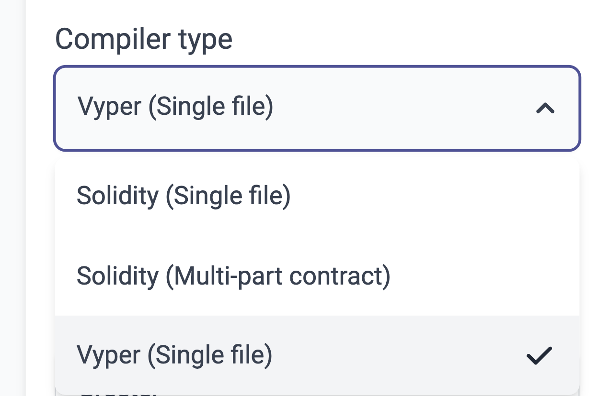
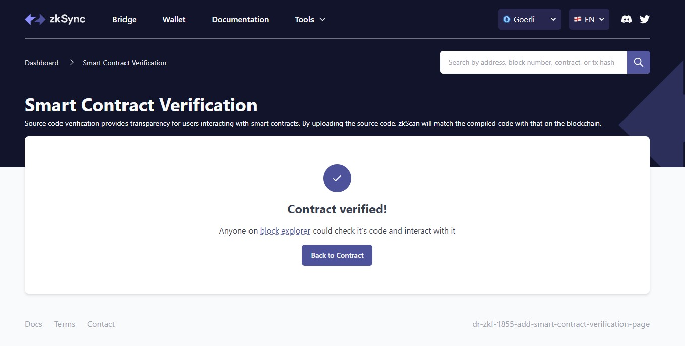

# id1621 SmartContractVerification page - Common - Smart contract verification - functional check (Vyper contract)

## Description
  - To verify the contract you need to proceed with the Vyper tutorial https://era.zksync.io/docs/tools/hardhat/hardhat-zksync-vyper.html

## Precondition

## Scenario
- Pass the tutorial
- Open https://goerli.explorer.zksync.io/contracts/verify
- Select Vyper (Single file) in "Compiler type"
  
- Fill all the fields and verify the contract
- Success screen shown after contract verification
    - Success mark displayed
- Headline
    - Contract verified!
- Text
    - Anyone on block explorer could check it's code and interact with it
- "Block explorer" is a link
  
- "Back to Contract" button
