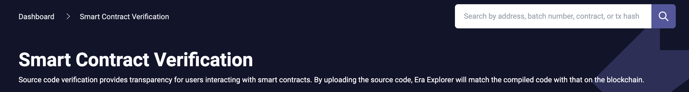

# id1871 SmartContractVerification page - Common - Artifacts - Header

## Description
  - https://goerli.explorer.zksync.io/contracts/verify

## Precondition

## Scenario
- Heading
    - Text - "Smart Contract Verification"
- Text
    - Source code verification provides transparency for users interacting with smart contracts. By uploading the source code, Era Explorer will match the compiled code with that on the blockchain.
      