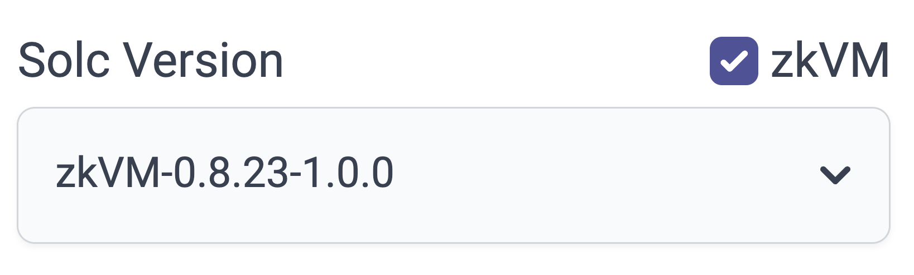
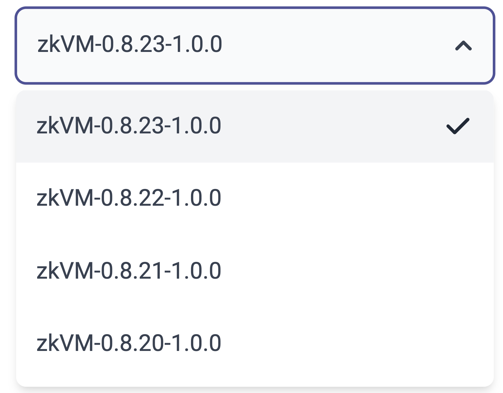
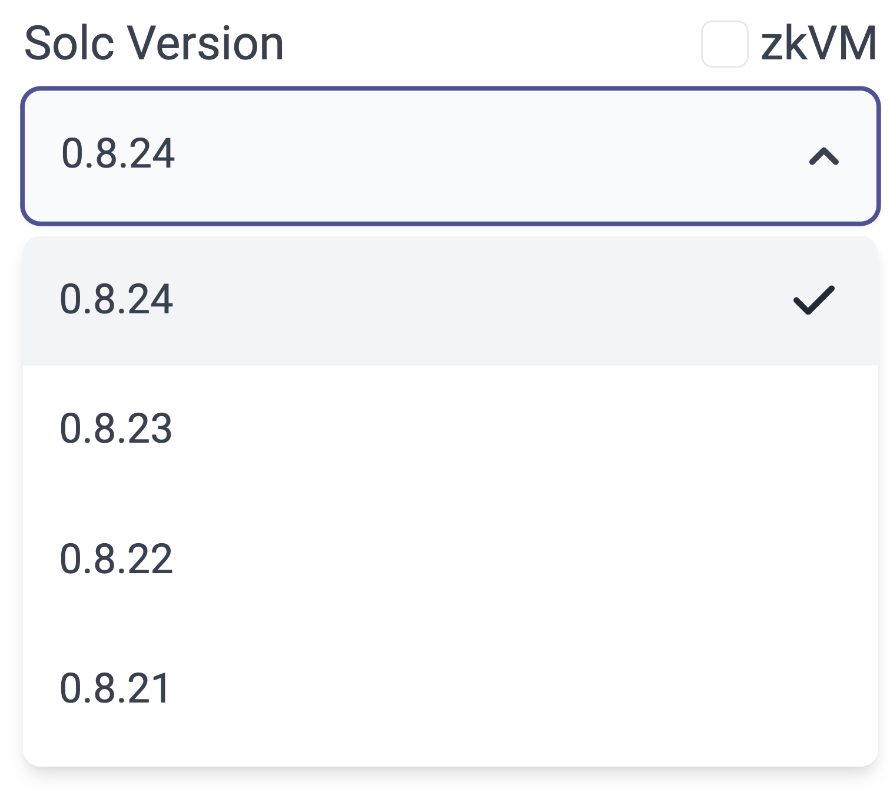

# id1906 SmartContractVerification page - Common - Actions - Verify zkEVM dropdown (Solidity)

## Description
  - https://sepolia.explorer.zksync.io/contracts/verify

## Precondition

## Scenario
- Select "Solidity (Single file)" or "Solidity (Multi-part contract)" in "Compiler type" dropdown
- Mark the "zkEVM" checkbox
  
- Verify only zkVM versions shown in the "Solc Version" dropdown
  
- Unmark the "zkEVM" checkbox
  
- Verify only solc versions shown in the "Solc Version" dropdown
  
