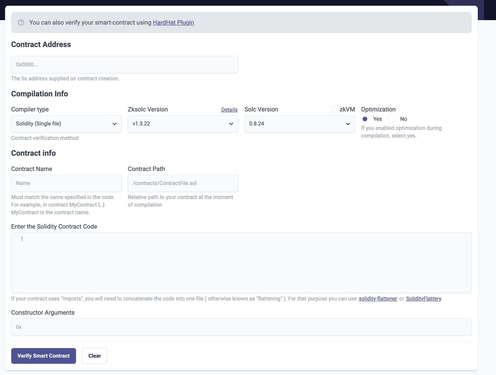

# id212 SmartContractVerification page - Common - Artifacts - Smart contract verification (UI for Single-Contract Solidity)

## Description
  - https://staging-scan-v2.zksync.dev/contracts/verify

## Precondition

## Scenario
- SCV interface:
  
- Notification
    - You can also verify your smart-contract using HardHat Plugin
- Link - "HardHat Plugin"
- "Contract Address" headline
    - Contract address field
    - Placeholder - "0x0000..."
- Text - "The 0x address supplied on contract creation."
- "Compilation Info" headline
    - "Compiler type" dropdown
    - Text - "Contract verification method"
- "Zksolc version" dropdown
    - "Details" link
- "Solc version" dropdown
    - "zkVM" checkbox
- Optimization
    - "Yes" radiobutton (enabled by default)
- "No" radiobutton
- Text - "If you enabled optimization during compilation, select yes."
- "Contract info" headline
    - "Contract Name" field
    - Placeholder: "Name"
- Text under the field
    - Must match the name specified in the code. For example, in contract MyContract \{..\} MyContract is the contract name.
- "Contract Path" field (for Zksolc \>=1.3.6 only)
    - Placeholder: /contracts/ContractFile.sol
- Text under the field: Relative path to your contract at the moment of compilation
- Enter the Solidity Contract Code
- Field for Solidity code
    - Text: "If your contract uses "imports", you will need to concatenate the code into one file (otherwise known as "flattening"). For that purpose you can use solidity-flattener or SolidityFlattery"
- Link: solidity-flattener
- Link: SolidityFlattery
- Constructor Arguments
- "Verify Smart Contract" button
- Clear button
