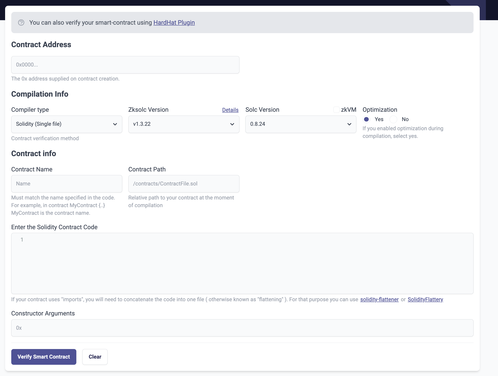

# id301 SmartContractVerification page - Common - Actions - Smart contract verification (e2e - Solidity)

## Description
  - https://staging-scan-v2.zksync.dev/contracts/verify
  - Need to perform Smart contract verification action.
  - Need to add appropriate test data for that:
  - - contract address
  - - contract name
  - - Solidity contract code

## Precondition

## Scenario
- SCV interface:
  
- Contract address field
- Contract Name
- Optimization
- ZkSolc compiler version
- Solc version
- Enter the Solidity Contract Code
- Constructor Arguments
- Verify button
- Clear button
