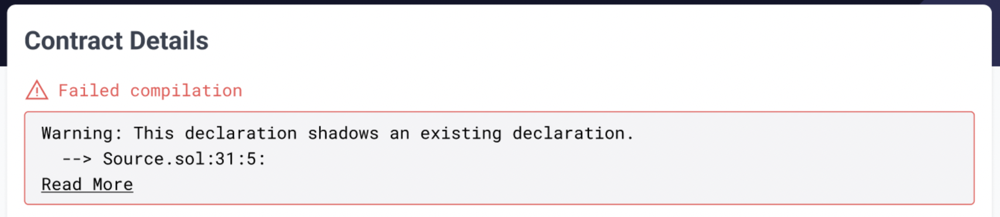

# id591 SmartContractVerification page - Common - Smart contract verification - functional check (negative)

## Description
  - To verify the contract you need to proceed with the tutorial Hello world https://v2-docs.zksync.io/dev/developer-guides/hello-world.html#prerequisites

## Precondition

## Scenario
- In the "Enter the Solidity Contract Code" field instead of real solidity code use any array of symbols
  