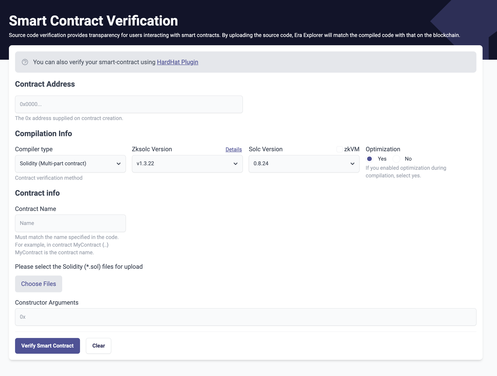
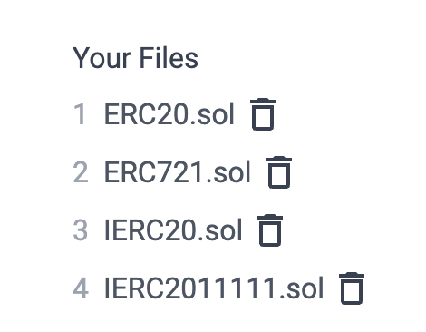
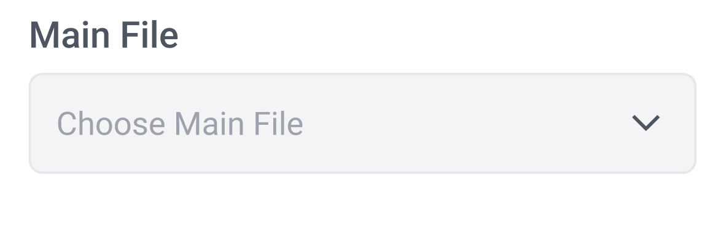

# id711 SmartContractVerification page - Common - Artifacts - Smart contract verification (UI for Multi-Contract Solidity)

## Description
  - https://staging-scan-v2.zksync.dev/contracts/verify

## Precondition

## Scenario
- SCV interface:
- 
- Notification
    - You can also verify your smart-contract using HardHat Plugin
- Link - "HardHat Plugin"
- "Contract Address" headline
    - Contract address field
    - Placeholder - "0x0000..."
- Text under the field: "The 0x address supplied on contract creation."
- "Compilation Info" headline
    - Compiler Type dropdown
- "Zksolc version" dropdown
    - "Details" link
- "Solc version" dropdown
    - zkEVM dropdown
- Optimization
    - "Yes" radiobutton (enabled by default)
- "No" radiobutton
- Text - "If you enabled optimization during compilation, select yes."
- "Contract info" headline
    - Contract Name
    - Placeholder: "Name"
- Text under the field
    - Must match the name specified in the code. For example, in contract MyContract \{..\} MyContract is the contract name.
- "Please select the Solidity (*.sol) files for upload" headline
    - "Choose Files" button
- "Your files" headline (shown after uploading files)
    - File number
- File name
- "Remove" button
  
- Main File (shown after uploading files)
    - "Choose main file" dropdown
      
- Constructor Arguments
- "Verify Smart Contract" button
- Clear button
