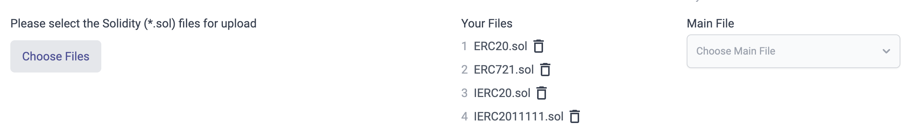

# id712 SmartContractVerification page - Common  - Verify adding files for Multi-Contract

## Description
  - https://staging-scan-v2.zksync.dev/contracts/verify

## Precondition

## Scenario
- Click "Choose Files" button
- Verify file selecting window opened
- Select few .sol files
- Verify "Your files" block displayed
    - File number
- File name
- "Remove" button
- Verify "Main File" headline displayed
- Verify "Choose main file" dropdown displayed
- Open "Choose main file" dropdown
- Verify main file can be selected from added files
  
