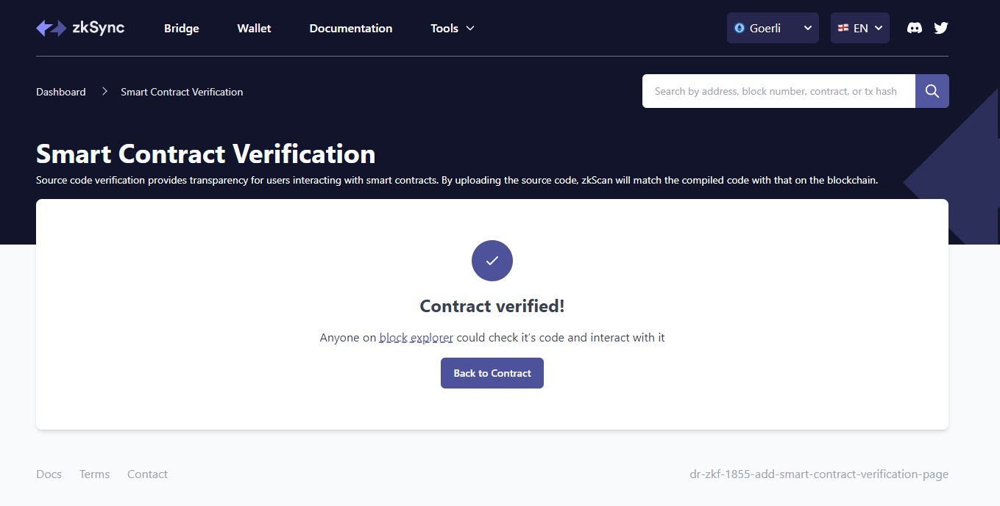

# id717 SmartContractVerification page - Common - Smart contract verification - functional check (multi-file contract)

## Description
  - 1) Download the latest version of repo https://github.com/JackHamer09/zkSync-era-Hardhat-example
  - 2) Go to https://goerli.staging-scan-v2.zksync.dev/contracts/verify
  - Example multifile contract:
  - First file - Main.sol
```
// SPDX-License-Identifier: MIT
pragma solidity ^0.8.0;
import "./Counter.sol";
contract Main \{
Counter private counter;
constructor() \{
counter = new Counter();
\}
function incrementCounter() public \{
counter.increment();
\}
function getCounter() public view returns (uint256) \{
return counter.getCount();
\}
\}
```
_________________________________________________
  - Second file - Counter.sol
``` // SPDX-License-Identifier: MIT
pragma solidity ^0.8.0;
contract Counter \{
uint256 private count;
function increment() public \{
count++;
\}
function getCount() public view returns (uint256) \{
return count;
\}
\}) 
```

## Precondition


## Scenario
- Open downloaded project zkSync-era-Hardhat-example
- Since we want to verify manually in the block explorer we need to comment line responsible for verification in the deployment script (deploy/custom.ts in our case). The line starts with 'await verify'
- Add file 1 and file 2 from description to contracts/ folder of downloaded zkSync-era-Hardhat-example project
- Run 'npm run compile'
- Run 'npm run deploy custom'
- Open Smart contract verification page
- Select "Multi-file contract" in "Compiler type" dropdown
- Fill all the fields
- Click "Verify smart contract"
  
