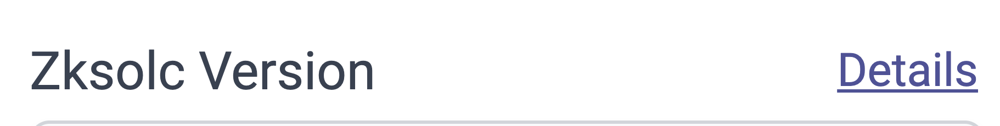
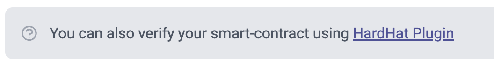
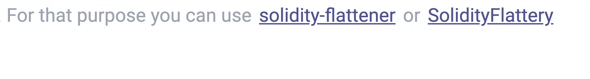

# id778 SmartContractVerification page - Common - Redirection

## Description
  - https://staging-scan-v2.zksync.dev/contracts/verify

## Precondition

## Scenario
- "Details" link redirects to
    - https://era.zksync.io/docs/api/tools/block-explorer/contract-verification.html#enter-contract-details
      
- HardHat Plugin link redirects to
    - https://era.zksync.io/docs/api/hardhat/hardhat-zksync-verify.html
      
- "solidity-flattener" link redirects to
    - https://github.com/BlockCatIO/solidity-flattener
- "SolidityFlattery" link redirects to
    - https://github.com/DaveAppleton/SolidityFlattery
      