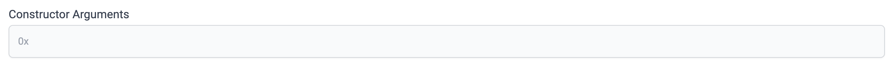

# id809 SmartContractVerification page - Common - Actions - Clearing the page (Multi-file)

## Description
  - https://sepolia.staging-scan-v2.zksync.dev/contracts/verify

## Precondition

## Scenario
- Select "Solidity (Multi-part contract)" in "Compiler type" dropdown
- Fill all the fields on Smart Contract Verification page:
    - Contract address field
- Contract Name
- Optimization
- ZkSolc compiler version
- Solc version
- Upload files
- Select Main file in "Main File" dropdown
- Constructor Arguments
- Click on Clear button
  
- Verify text fields are cleared
  
  
  
- Verify "ZkSolc version" and "Solc Version" dropdowns  set to default values (latest versions)
- Verify "Optimization" radio buttons set to default values (Yes)
- Verify uploaded files removed
