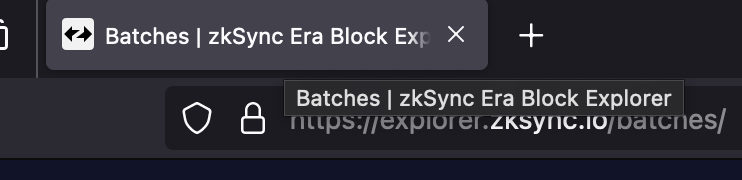

# id127 Common - Tab title

## Description
  - Account: Address \<hash\> | zkSync Era Block Explorer
  - Block: Block \<block number\> | zkSync Era Block Explorer
  - Contraxt: Address \<hash\> | zkSync Era Block Explorer
  - Transaction: Transaction \<hash\> | zkSync Era Block Explorer

## Precondition

## Scenario
- Tabs titles have general pattern
    - page specific | zkSync Era Block Explorer
      