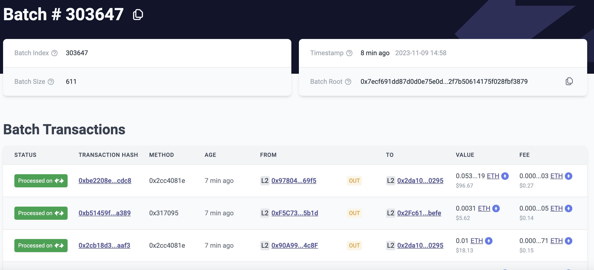

# id1863 Common - URL query support - Batch

## Description
  - https://linear.app/matterlabs/issue/UEXP-4596/be-fe-search-query-url
  - https://explorer.zksync.io/search?q=\{batch number\} - will open a batch page for the specified batch number.

## Precondition

## Scenario
- Open https://goerli.explorer.zksync.io/
    - Add "\{Basic URL\}/search?q=303647 to the URL address (note this batch number is for Mainnet Network)
- URL is converted to "\{Basic URL\}/batch/303647"
- Page for Batch information page is opened
  