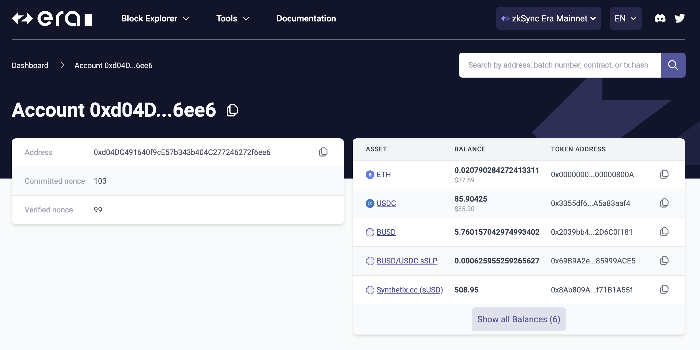

# id1864 Common - URL query support - Address

## Description
  - https://explorer.zksync.io/search?q=\{address\} - will open an address page for the specified address.

## Precondition

## Scenario
- Open https://sepolia.explorer.zksync.io/
    - add "\{Basic URL\}/search?q=0xd04DC491640f9cE57b343b404C277246272f6ee6" (note this address is for Mainnet Network)
- URL is converted automatically to "\{Basic URL\}/address/0xd04DC491640f9cE57b343b404C277246272f6ee6"
- Page with information about specified address is opened
  