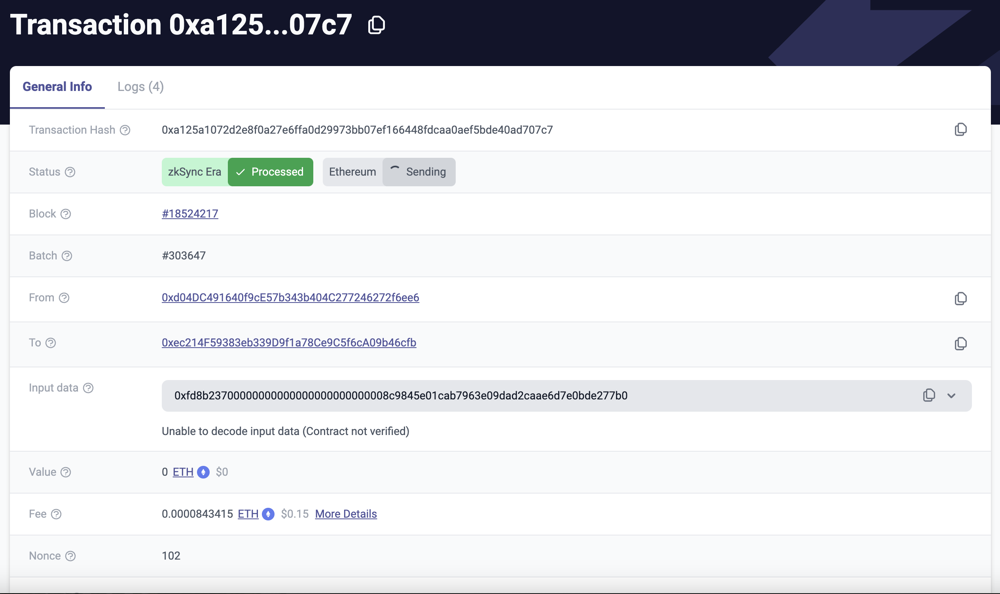

# id1865 Common - URL query support - Transaction Hash

## Description
  - https://linear.app/matterlabs/issue/UEXP-4596/be-fe-search-query-url
  - https://explorer.zksync.io/search?q=\{txhash\} - will open a transaction page for the specified tx hash.

## Precondition

## Scenario
- Open https://goerli.explorer.zksync.io/
    - add \{Basic URL\}/search?q=0xa125a1072d2e8f0a27e6ffa0d29973bb07ef166448fdcaa0aef5bde40ad707c7 to the Basic page URL (note this tx hash is for Mainnet Network)
- URL is converted to "\{Basic URL\}/tx/0xa125a1072d2e8f0a27e6ffa0d29973bb07ef166448fdcaa0aef5bde40ad707c7"
- Transaction page is opened
  