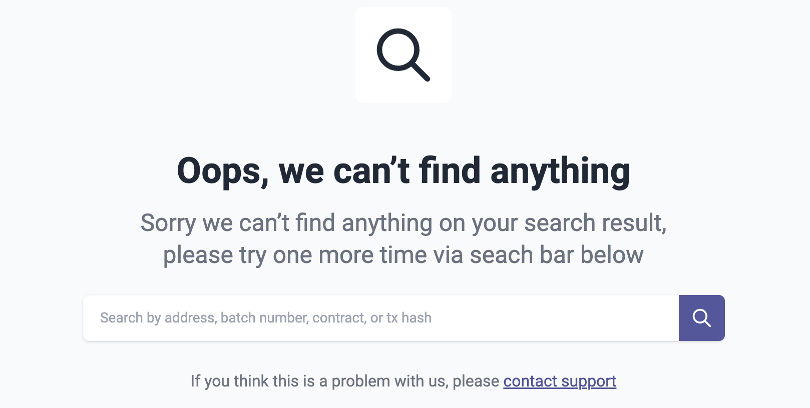

# id1866 Common - URL query support - Incorrect values

## Description

## Precondition

## Scenario
- Open https://sepolia.explorer.zksync.io/
- Transaction Hash
    - add \{Basic URL\}/search?q=0xa125a1072d2e8f0a27e6ffa973bb07ef166448fdcaa0aef5bde40ad707c7
    - "Oops, we can’t find anything" page is opened
      
- Address
    - add "\{Basic URL\}/search?q=0xd04DC491640f9c123b404C277246272f6ee6"
    - "Oops, we can’t find anything" page is opened
      
- Batch
    - Add "\{Basic URL\}/search?q=31211122647 to the URL address
    - "Oops, we can’t find anything" page is opened
      