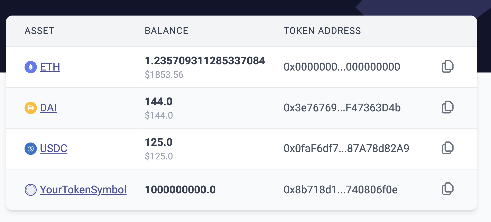

# id261 Acc page - Pages - Artifacts (Balances)

## Description
  - https://staging-scan-v2.zksync.dev/address/0x8f0F33583a56908F7F933cd6F0AaE382aC3fd8f6

## Precondition

## Scenario
- Balances table displays the balance of L2
    - Asset/Token
- Balance
- Address/smart contract hash
- USD price is displayed for ERC20 tokens
- USD prices have 2 figures after the dot maximum (1 figure in case it is 0)
  