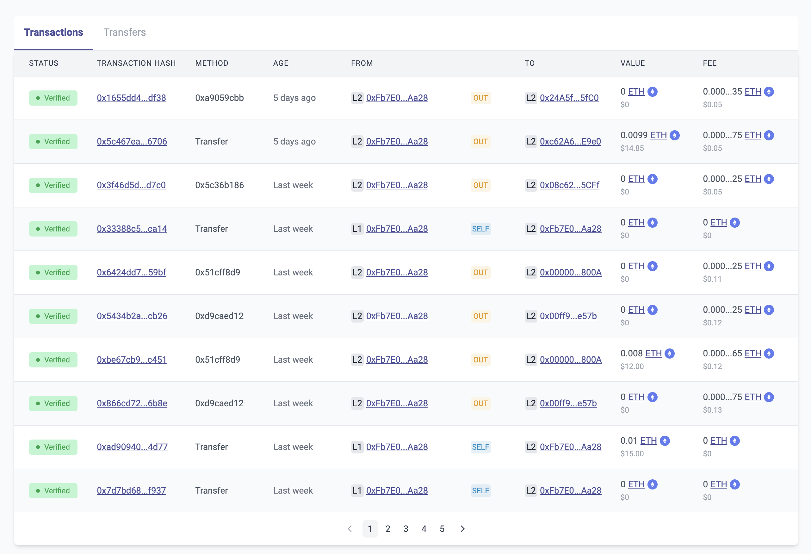
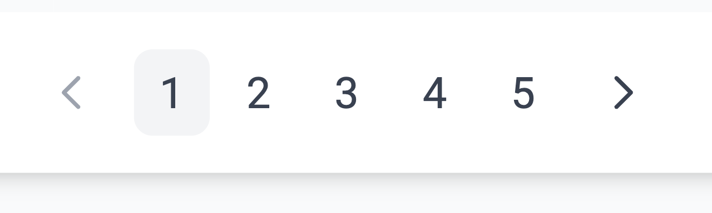

# id262 Acc page - Pages - Artifacts (Transactions)

## Description
  - https://staging-scan-v2.zksync.dev/address/0x08d211e22db19741ff25838a22e4e696fee7ed36

## Precondition

## Scenario
- 'Transactions' tab contains transactions with fields:
    - Status
    - Included
- Verified
- Transaction Hash
    - 0x34ae379cb2e2e319322a5476fbac7d98241e1ebc35bb5c7bb07f775d660f0b00
- Method
- Age
    - 'X' days (depends on the current date)
- Timestamp can be copied on click
- From
    - 0x08d211e22db19741ff25838a22e4e696fee7ed36
- L1/L2 labels labels displayed
- Direction
    - In
- Out
- Self
- To
    - 0x08d211e22db19741ff25838a22e4e696fee7ed36
- L1/L2 labels displayed
- Value (in ETH only)
- Fee (Fee in ETH only)
    - 0.01 ETH
      
- Pagination element with pages displayed in case there are 10+ txs for this account
  
- Open any page
- Verify 10 other transactions loaded (if so many exist)
