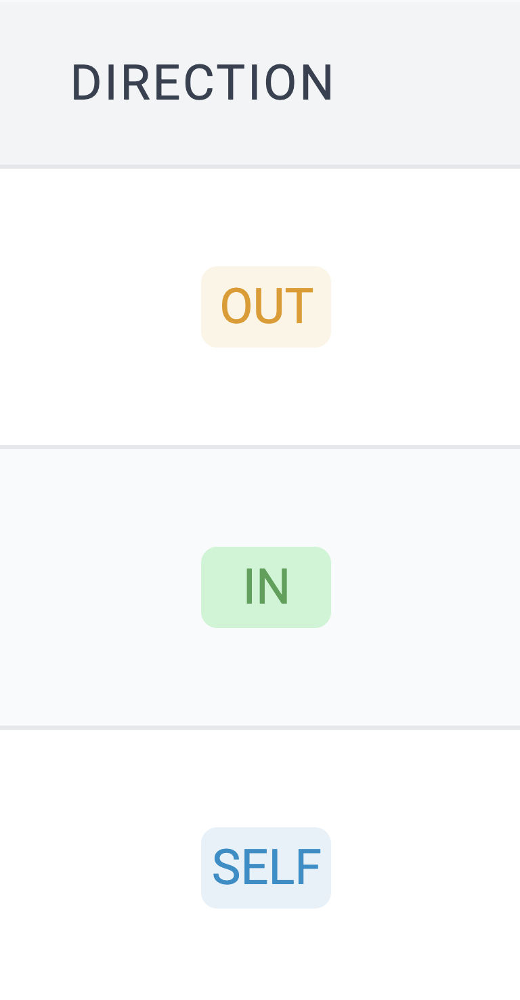

# id380 Acc page - Pages - Verify "IN" label

## Description
  - - I am on https://staging-scan-v2.zksync.dev/address/addresshash page (https://sepolia.explorer.zksync.io/address/0xd0a16CBeb6da098B872785bFAc282f84F8Ca5993)
  - Preconditions: Make transaction from L1/L2 address to another L2 address

## Precondition

## Scenario
- Open reveiver Account page
- Find the transaction you made previously
- Verify "IN" label displayed for the transaction
  