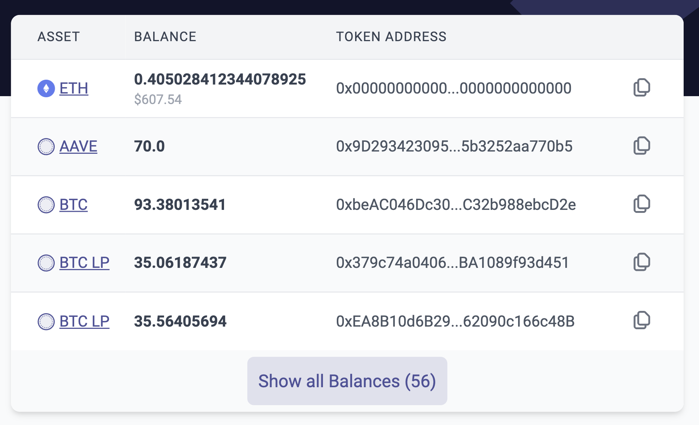
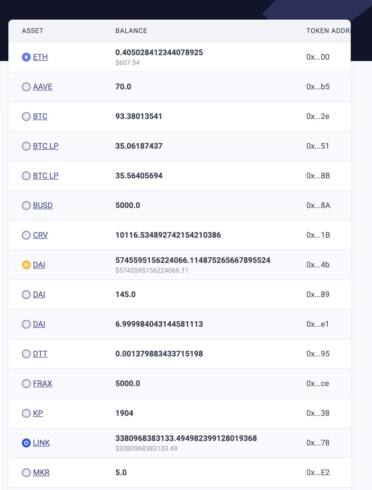

# id800 Acc page - Pages - Verify collapsed state for Balances

## Description
  - Open page with a lot of tokens balance (5+ tokens) (https://sepolia.staging-scan-v2.zksync.dev/address/0x46D8e47b9A6487FDAB0a700b269A452cFeED49Aa)

## Precondition

## Scenario
- Balances table displays the balance of L2
    - Asset/Token
- Balance
- Address/smart contract hash
- USD price is displayed for ERC20 tokens
- 5 tokens displayed in the table
- "Show all Balances \{number\}" button displayed under the tokens list
- Number of all tokens displayed on "Show all Balances \{number\}" button
  
- Click on "Show all Balances \{number\}" button
- Verify expanded list of tokens displayed
  