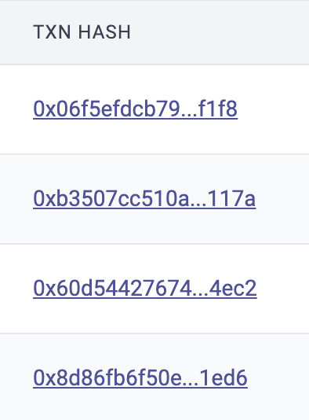
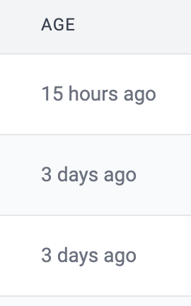
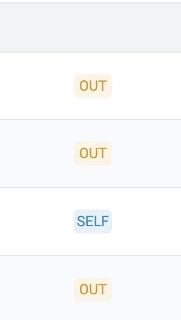
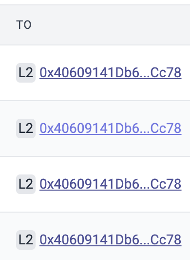
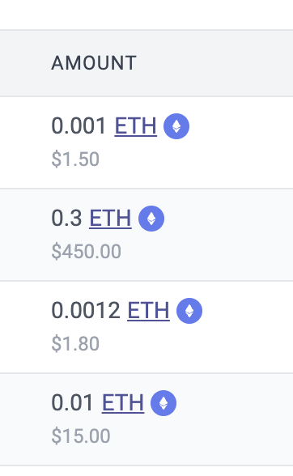
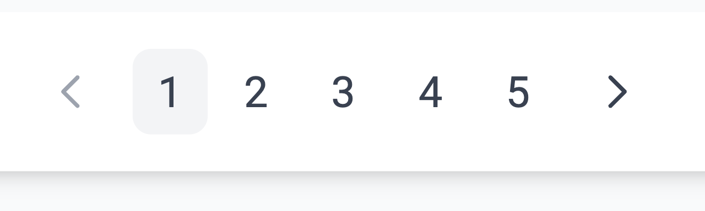

# id928 Acc page - Pages - Artifacts (Transactions) -  Transfers tab

## Description
  - https://sepolia.explorer.zksync.io/address/0x46D8e47b9A6487FDAB0a700b269A452cFeED49Aa

## Precondition

## Scenario
- ERC20 Transfers tab contains:
    - Transaction hash

- Age
    - Can be copied

      

- From
    - L1/L2 displayed

      

- Direction
    - IN/OUT/SELF

      

- To
    - L1/L2 displayed

      

- Amount

  

- Pagination element (in case there are 10+ txs for this account)

  