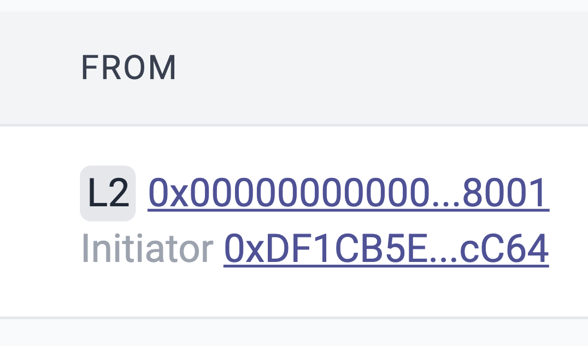
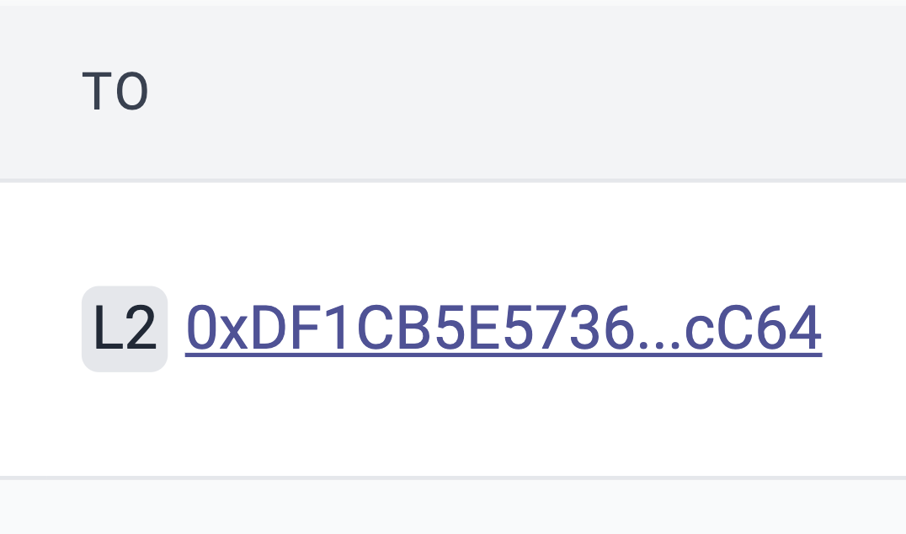

# id235 Block page - Pages - Navigation (Addresses)

## Description

## Precondition

## Scenario
- Transaction hash navigates to transaction page
    - https://staging-scan-v2.zksync.dev/tx/0x60cd512dd7f878ccc9a1f74ee6d9c983e9379c0176e4ecea30e422544f409678
- FROM L2 (if any) hash navigates to Account page
    - https://staging-scan-v2.zksync.dev/address/0x46D8e47b9A6487FDAB0a700b269A452cFeED49Aa
      
- TO L2 (if any) hash navigates to Account page
    - https://staging-scan-v2.zksync.dev/address/0xa7afA3DFe5840A33bacbF961F38f1FDe05DcaEa2
      
- Fee -\> Contract
    - https://staging-scan-v2.zksync.dev/address/0x0000000000000000000000000000000000000000
- Amount -\> Contract
    - https://staging-scan-v2.zksync.dev/address/0x0000000000000000000000000000000000000000
