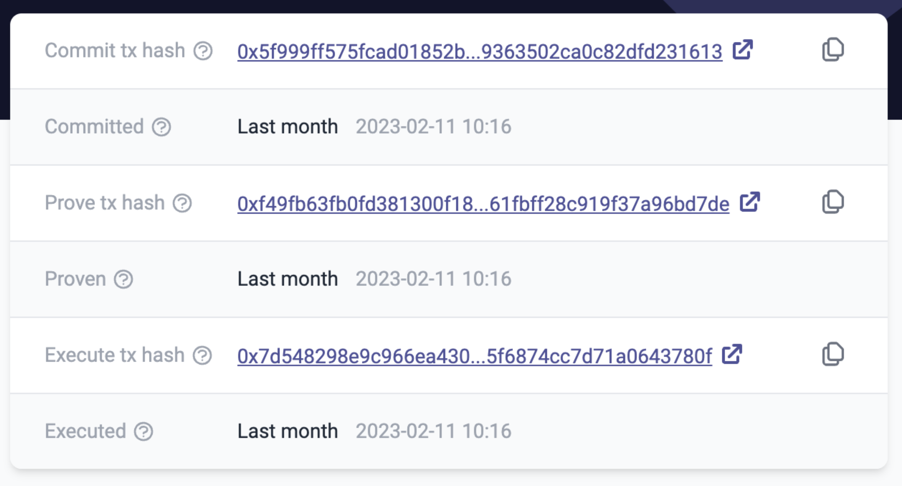

# id264 Block page - Pages - Artifacts (Right table)

## Description

## Precondition

## Scenario
- Right block table contains the following fields:
    - Commit tx hash
    - Link to sepolia.etherscan.io
- Committed
- Prove tx hash
    - Link to sepolia.etherscan.io
- Proven
- Execute tx hash
    - Link to sepolia.etherscan.io
- Executed
  