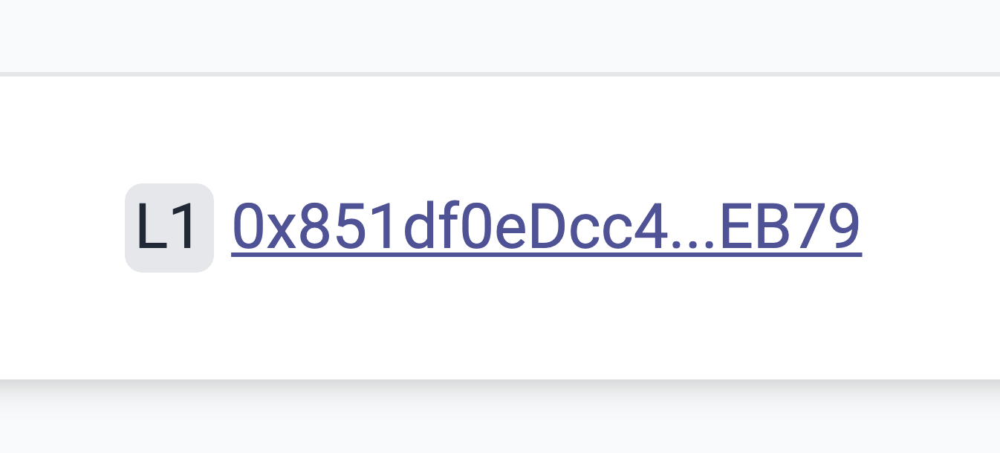

# id368 Block page - Pages - Redirection (Addresses)

## Description
  - http://localhost:3000/block/12

## Precondition

## Scenario
- FROM L1 (if any) hash redirects to sepolia.etherscan.io
    - https://sepolia.etherscan.io/address/0x388ea662ef2c223ec0b047d41bf3c0f362142ad5
      
- TO L1 (if any) hash redirects to sepolia.etherscan.io
    - https://sepolia.etherscan.io/address/0x388ea662ef2c223ec0b047d41bf3c0f362142ad5
