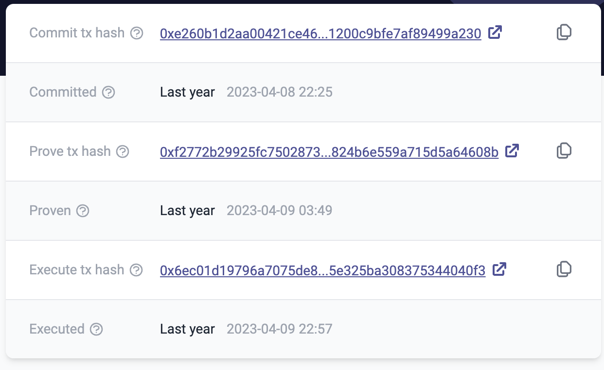

# id554 Block page - Pages - Verify hover state for links

## Description
  - Open https://explorer.zksync.io/block/1085863 page

## Precondition

## Scenario
- Verify links on the Block page change the color to bright purple in hover state
    - Commit tx hash link
    - https://goerli.etherscan.io/tx/0xb542d8ea547718ab507d24b4ac477e05da389ef2bdf9f2d18562b4dd68697da5
- Prove tx hash link
    - https://goerli.etherscan.io/tx/0x0fa305cfbbf1061cfda3a0ed7d2c6b130446ddfd4e8b39040af9716f7e228b8d
- Execute tx hash link
    - https://goerli.etherscan.io/tx/0x1999cbc497d3046fdc31a14a290ceed91ab382d9ffb03e096920128801a2cb81
- Transaction hash links
    - https://staging-scan-v2--pr167-zkf-2535-commit-prov-4myhh1jq.web.app/tx/0x062961cd3c256e0cd57bbe43240babb9685c869462617f587d109cfa5d15876f
- https://staging-scan-v2--pr167-zkf-2535-commit-prov-4myhh1jq.web.app/tx/0xbf90e275875f19d91479c4fb729be56c72de0f533f1bf9604b5b4563acea3bc8
- From links
    - https://staging-scan-v2--pr167-zkf-2535-commit-prov-4myhh1jq.web.app/address/0x2b595cd75093440be9451bc363e5998b10481e42
- To links
    - https://staging-scan-v2--pr167-zkf-2535-commit-prov-4myhh1jq.web.app/address/0xb3ff73f6d56f381d093d1b2fb20215aa2c79da0e
- Amount token links
- Fee token links
  
