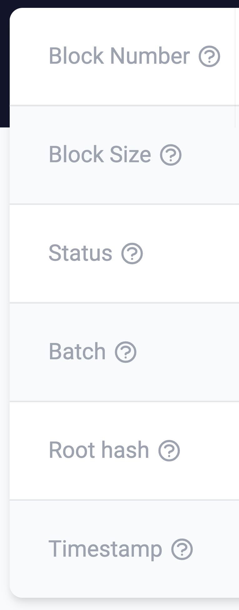

# id567 Block page - Pages - Verify icons for informational tooltips (Left table)

## Description
  - /block/63781

## Precondition

## Scenario
- Informational tooltip icon available for the fields labels of left block table:
    - Block Number
- Block Size
- Status
- Batch
- Root Hash
- Timestamp

  