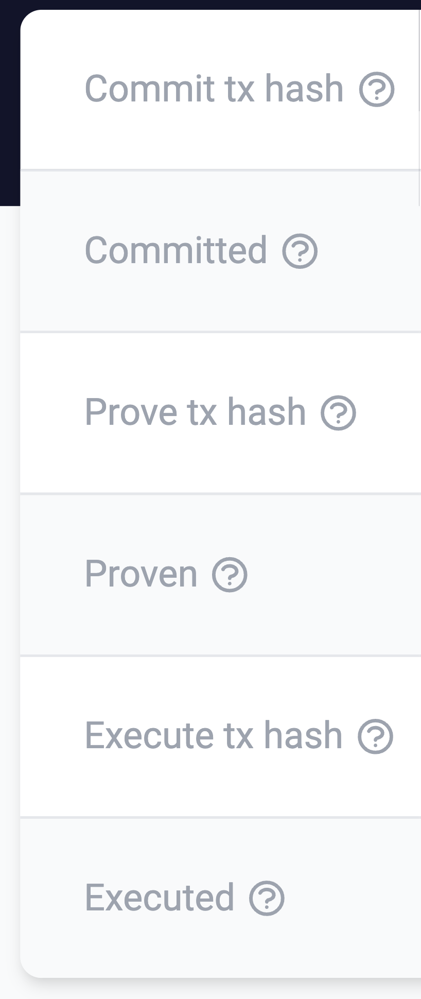

# id569 Block page - Pages - Verify icons for informational tooltips (Right table)

## Description
  - /block/63781

## Precondition

## Scenario
- Informational tooltip icon available for the fields labels of right block table:
    - Commit tx hash
- Committed
- Prove tx hash
- Proven
- Execute tx hash
- Executed

  