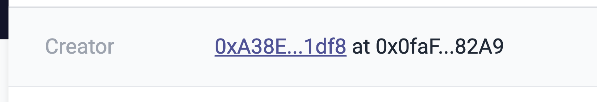
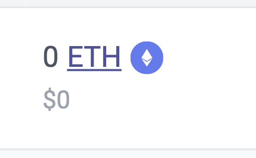
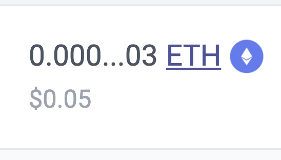

# id242 Contract page - Pages - Navigation (Transactions)

## Description
  - I am on Contract page, eg /address/0xd88D4d772D4acaD83452b412bc99456aA2a21dc7

## Precondition

## Scenario
- Item \{\} navigates to \{\}:
    - Creator to an Account page
    - https://sepolia.explorer.zksync.io/address/0xA38EDFcc55164a59e0f33918D13a2d559BC11df8

  
- Transaction Hash to a Transaction page
    - https://sepolia.explorer.zksync.io/tx/0x7f14987f70efbc93e127ba36283a5893697a539424c5ee1e922f902b1da423a9
- L2 From -\> to Account page
    - https://sepolia.explorer.zksync.io/address/0x56DDd604011c5F8629bd7C2472E3504Bd32c269b
- L2 To -\> to Account page
    - https://sepolia.explorer.zksync.io/address/0x213e2cbF26Bb8822C1057c6721d99807f8BC7531
- VALUE to contract
    - https://sepolia.explorer.zksync.io/address/0x000000000000000000000000000000000000800A

  
- FEE to contract
    - https://sepolia.explorer.zksync.io/address/0x000000000000000000000000000000000000800A

  