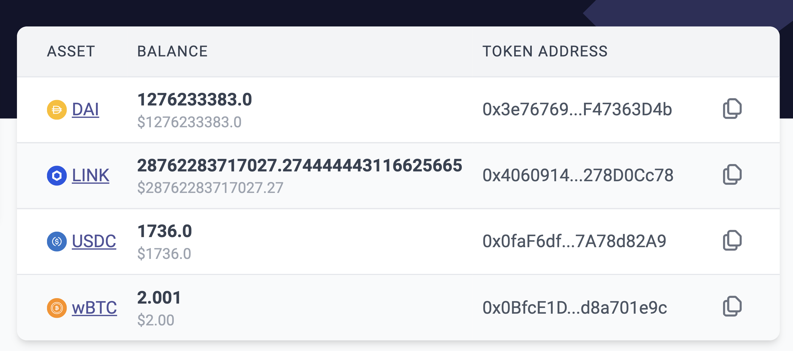

# id267 Contract page - Pages - Artifacts (Balances)

## Description
  - Automation temporary switched off due to regenesis, check before release
  - https://staging-scan-v2.zksync.dev/address/0x4E14EC08875c88f9B0Cf2A075F481EDa0143d1f0

## Precondition

## Scenario
- Balances table contains:
    - Asset
- Balance
- Address
  
- Balances table values are optional
