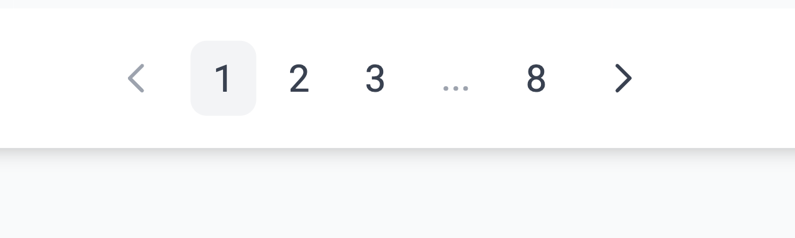

# id270 Contract page - Pages - Artifacts (Transactions)

## Description
  - https://goerli.staging-scan-v2.zksync.dev/address/0x614cbc518294b54bd41f41b31c4f1ebfdd81cd39

## Precondition

## Scenario
- Transactions tab contains:
    - Status
- Transaction hash
- Method
- Age
    - Timestamp can be copied on click
- From
    - L1/L2 displayed
- Direction -  In/Out (as value)
- To
    - L1/L2 displayed
- Value
- Fee
- Check that address has 4 digits after ...
  
- Pagination element displayed for 'Latest transactions' (in case there are 10+ txs for this contract)
  
- Open any page
- Verify 10 other transactions loaded (if so many exist)
