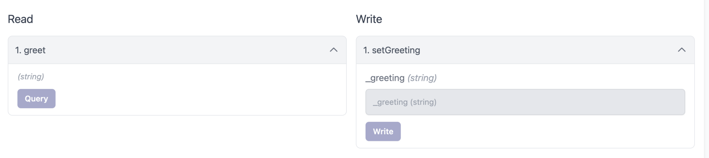

# id427 Contract page - Pages - Verify list of methods on the "Contracts" tab for contract with events

## Description
  - https://staging-scan-v2.zksync.dev/address/contract_address
  - Prerequisites: (you can use https://github.com/JackHamer09/zkSync-2.0-Hardhat-example guide) or search for 0xaed6e18d8fe6397fc622a17402e8eb350d6d6c45 contract
  - 1. upload your own contract with methods
  - 2. verify this contract

## Precondition

## Scenario
- Open Contract's page
- Click on the "Contract" tab
- Verify correct Read and Write methods for interacting with this smart contract displayed (below are the methods for test contract from description)
    - Read
    - greet
- Write
    - setGreeting

