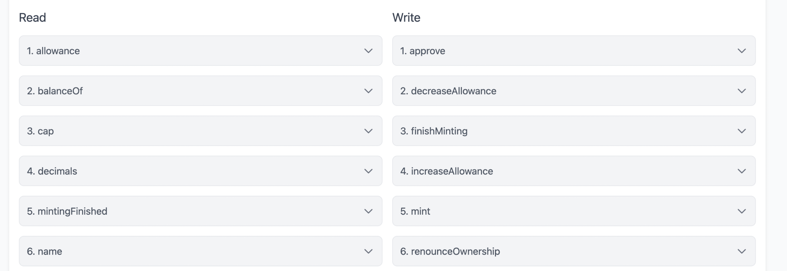
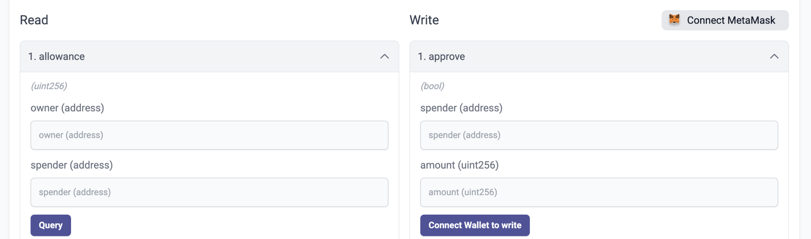

# id429 Contract page - Pages - Verify the content of method components on the "Contracts" tab

## Description
  - https://staging-scan-v2.zksync.dev/address/contract_address
  - Prerequisites: (you can use https://github.com/JackHamer09/zkSync-2.0-Hardhat-example guide)
  - 1. upload your own contract with methods
  - 2. verify this contract

## Precondition

## Scenario
- Open Contract's page
- Click on the "Contract" tab
- Open any method component
  
- Verify method contains:
    - Description of the parameter
- Type of this parameter
- Input for this parameter (optional)
  