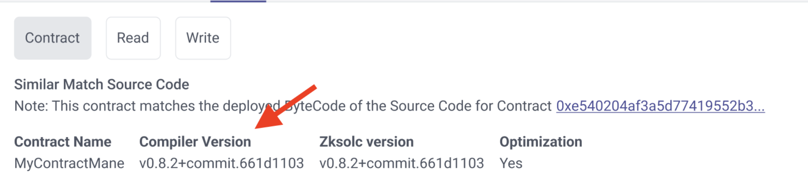
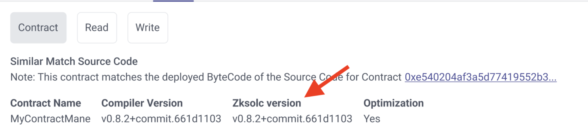
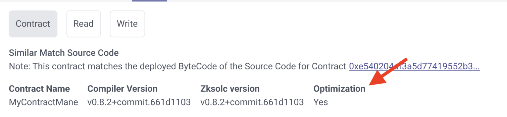
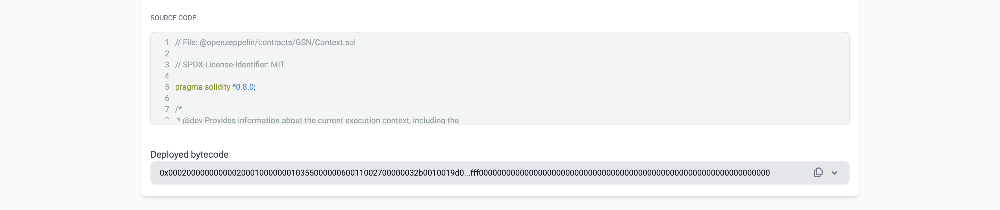

# id430 Contract page - Pages - Artifacts ("Contracts" tab for verified contract)

## Description
  - https://staging-scan-v2.zksync.dev/address/contract_address
  - Prerequisites: (you can use https://github.com/JackHamer09/zkSync-2.0-Hardhat-example guide) or search for 0xaed6e18d8fe6397fc622a17402e8eb350d6d6c45 contract
  - 1. upload your own contract with methods
  - 2. verify this contract

## Precondition

## Scenario
- Contract tab for verified contract contains:
    - Contract Name
    - Name of the contract displayed under the "Contract Name" title
      
- Compiler version
    - Version of compiler displayed under the "Compiler version" title
      
- Zksolc version
    - Version of zksolc displayed under the "Zksolc version" title
      
- Optimization
    - Optimization parameter (yes/no) displayed under the "Optimization" title
      
- Contract Source Code
    - Text: "Single file contract"
- "Copy" button
- "Expand" button
- Block with contract's code
- Drop Down menu
    - DEPLOYED BYTECODE HASH
      
