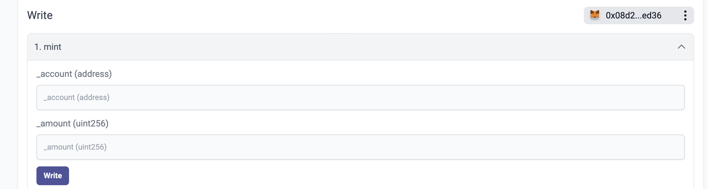
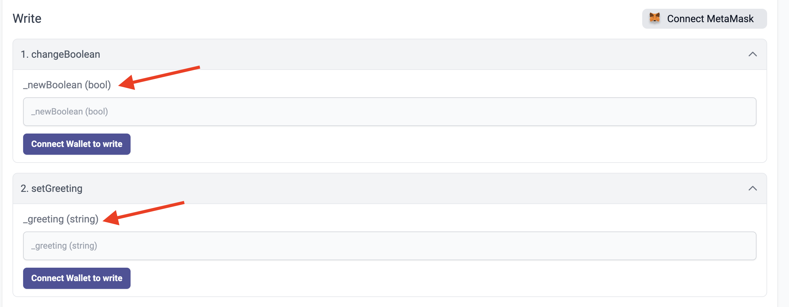

# id573 Contract page - Pages - Verify Write methods

## Description
  - https://staging-scan-v2.zksync.dev/address/contract_address
  - Prerequisites: (you can use https://github.com/JackHamer09/zkSync-2.0-Hardhat-example guide) or search for 0x772ab24587013a106e08f3868ef18361c8f3a4da contract
  - upload your own contract for token with methods
  - verify this contract
  - Contract for data types check: https://goerli.explorer.zksync.io/address/0x17F9DE77Bd0737Eeb47cD01f30424f5D08A21b25#contract

## Precondition

## Scenario
- Open Contract's page
- Click on the "Contract" tab
- Verify user can't interact with Write Methods when MetaMask wallet is not connected - Write Methods should be inactive
- Verify user has the instruction to connect the wallet (button name "Connect wallet to write"
- Connect MM wallet
- Verify user can interact with Write Methods when MetaMask wallet is connected - Write Methods should be active
  
- Verify all the data types work correctly as inputs
    - uint256
- string
- bool
  
