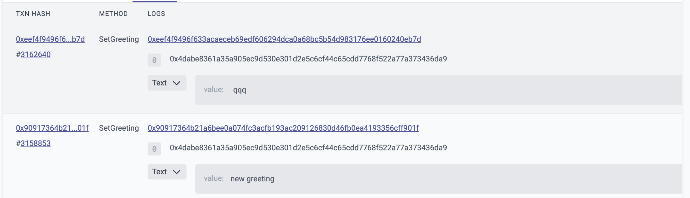

# id576 Contract page - Pages - Artifacts (Events tab)

## Description
  - Open Contract page of a contract that has tx with events
  - E.g. https://goerli.staging-scan-v2.zksync.dev/address/0x0000000000000000000000000000000000008006 (Events tab)
  - Prerequisites: (you can use https://github.com/JackHamer09/zkSync-2.0-Hardhat-example guide)
  - 1. upload your own contract with event
  - 2. verify this contract
  - 3. make a transaction

## Precondition

## Scenario
- Events tab of Contract page contain:
    - Txn Hash
    - Hash of tx with the event
- Block in which this event have been emitted
- Method
    - Method name displayed in human readable format if the SC is verified
- Logs
    - Address
- Topics
- Data
- Verify 25 items per one page displayed
  