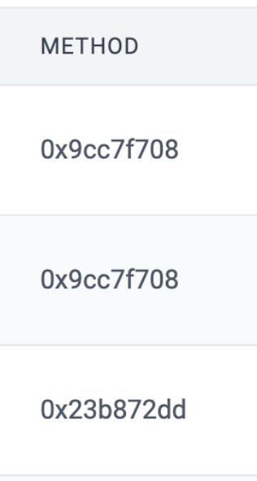

# id578 Contract page - Pages - Verify "Method" column for non verified contract

## Description
  - https://sepolia.staging-scan-v2.zksync.dev/address/0x0000000000000000000000000000000000000000

## Precondition

## Scenario
- Open page for non verified contract
- Verify "Method" column displayed for non verified contract in "Transactions" tab
- Verify method signature (not method name) displayed in "Method" column for non verified contract (first 10 symbols of calldata/input data of the contract)
  