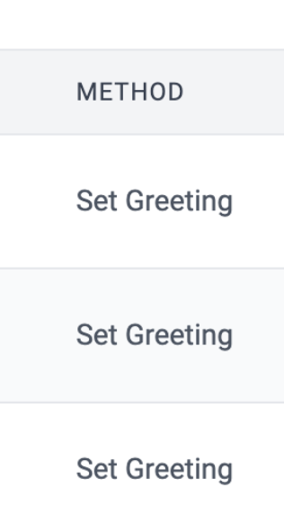

# id579 Contract page - Pages - Verify "Method" column for verified contract

## Description
  - https://sepolia.staging-scan-v2.zksync.dev/address/0x614cbc518294b54bd41f41b31c4f1ebfdd81cd39#transactions - page for verified contract with at least 1 tx

## Precondition

## Scenario
- Open page for verified contract
- Verify "Method" column displayed for verified contract in "Transactions" tab
- Verify method name displayed in "Method" column for verified contract

  