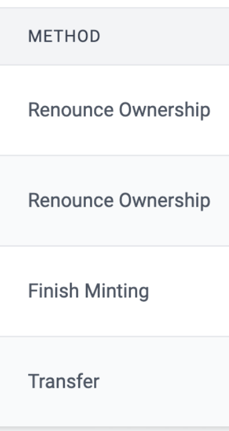

# id580 Contract page - Pages - Verify "Method" column for verified token's contract

## Description
  - https://sepolia.staging-scan-v2.zksync.dev/address/0x1babcaea2e4be1f1e1a149c454806f2d21d7f47c - page for verified token's contract with at least 1 tx

## Precondition

## Scenario
- Open page for verified token's contract
- Verify "Method" column displayed for verified contract in "Transactions" tab
- Verify method name displayed in "Method" column for verified contract

  