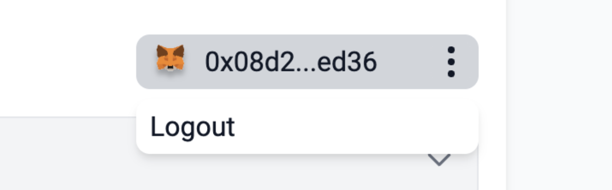
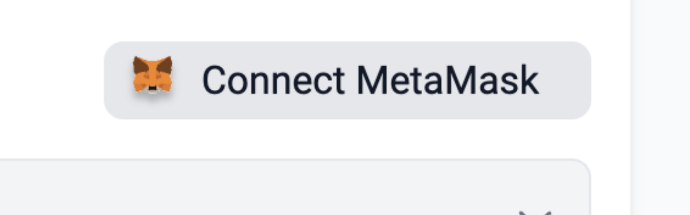

# id581 Contract page - Pages - Disconnect MetaMask (Logout)

## Description
  - https://staging-scan-v2.zksync.dev/address/contract_address
  - Prerequisites: (you can use https://github.com/JackHamer09/zkSync-2.0-Hardhat-example guide) or search for 0x772ab24587013a106e08f3868ef18361c8f3a4da contract
  - upload your own contract for token with methods
  - verify this contract
  - Prerequisites:
  - Connect MetaMask wallet on "Contract" tab

## Precondition

## Scenario
- Open Contract's page
- Click on the "Contract" tab
- Go to "Write" tab of Contract
- Click 3 dots button next to the wallet address
- "Logout" option available
  
- Click "Logout"
- Verify Metamask disconnected
- Verify wallet address changed to  "Connect MetaMask" button
  