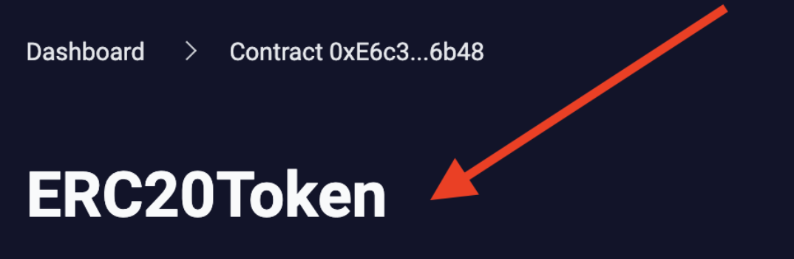

# id648 Contract page - Pages - Verify contract name for verified contract

## Description
  - Open any pege of verified contract (e.g. https://goerli.staging-scan-v2.zksync.dev/address/0xE6c391927f0B42d82229fd3CFe3426F209D16b48)

## Precondition

## Scenario
- Open Contract's page
- Verify contract address not shown in a headline on the top of the page
- Verify the name of the contract added to the headline of the page.
  