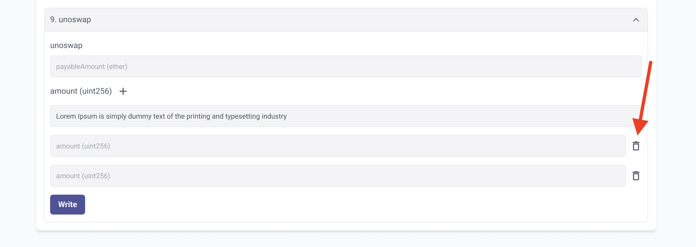

# id658 Contract page - Pages - Verify removing inputs for methods

## Description
  - https://https://goerli.staging-scan-v2.zksync.dev/address/0xAED6e18d8fe6397fc622A17402e8EB350d6D6c45#contract

## Precondition

## Scenario
- Open Contract's page
- Click on the "Contract" tab
- Verify Icon "+" is available for parameter if this parameter could accept several values.
- Click "+" button
- One more input for this parameter is added
- Click "Remove" button
  
- Verify the input for parameter is removed
