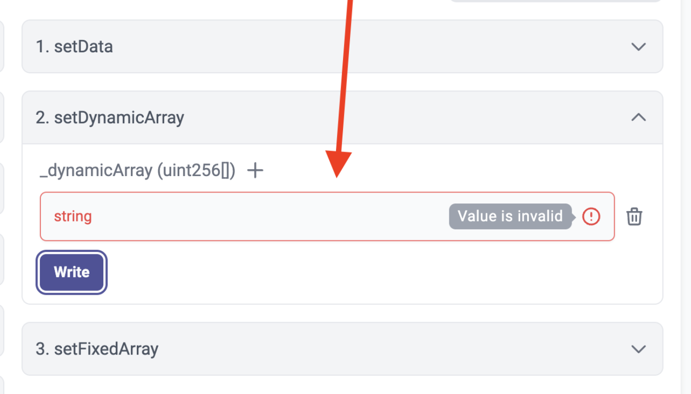

# id660 Contract page - Pages - test

## Description
- https://https://goerli.staging-scan-v2.zksync.dev/address/0xAED6e18d8fe6397fc622A17402e8EB350d6D6c45#contract

## Precondition

## Scenario
- Open Contract's page
- Click on the "Contract" tab
- Verify Icon "+" is available for parameter if this parameter could accept several values.
- Click "+" button
- One more input for this parameter is added
- Enter incorrect input (e.g. text string in uint256 field)
- Click "Write" button
- Verify error message displayed for the field with incorrect input
  