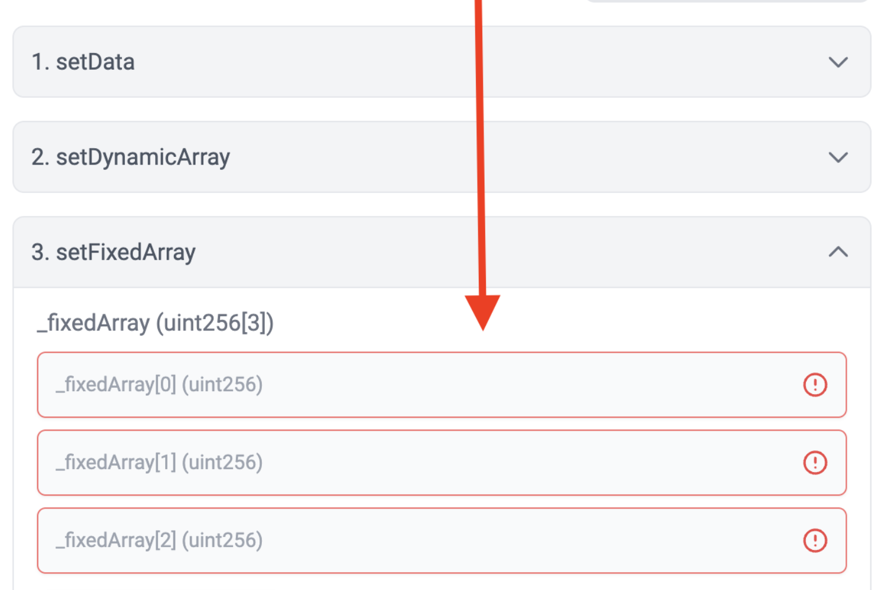

# id662 Contract page - Pages - Verify fixed-size arrays as an input

## Description
  - https://https://goerli.staging-scan-v2.zksync.dev/address/0xAED6e18d8fe6397fc622A17402e8EB350d6D6c45#contract

## Precondition

## Scenario
- Open Contract's page
- Click on the "Contract" tab
- Click "setFixedArray" dropdown (method with fixed array)
- Verify none of the inputs can be empty
- Verify amount of inputs is equal to predefined array size (3)
- Verify inputs can't be added or removed - buttons "+" and "remove" not shown
  