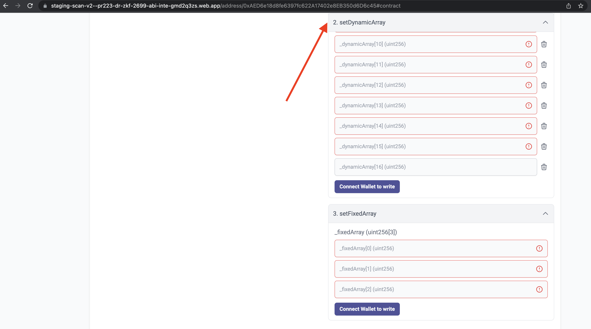

# id663 Contract page - Pages - Verify fixed header for "write" methods

## Description
  - https://sepolia.staging-scan-v2.zksync.dev/address/0x53d67E04c777a725C05399850eb942348444B5AF#contract

## Precondition

## Scenario
- Open Contract's page
- Click on the "Contract" tab
- Click "setDynamicArray" dropdown
- Click "+" button to add more inputs
- Add 15 new inputs
- Scroll the page
- Verify "setDynamicArray" dropdown header is sticked on the top of the page while scrolling
  